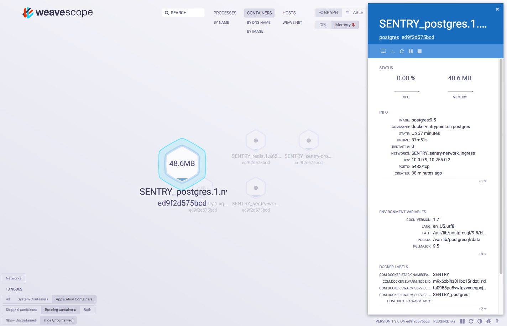

# SCOPE

Scope is a simple visualization tool to get a quick   view of what containers and stacks are running.

SCOPE provides a dashboard similar to this:



The information is sufficiently different from Grafana and hence, it might be ok to support both tools.

## Usage

SCOPE runs on each node of a docker swarm.

We provide a script to set up ssh tunnels to the Scopes. Identify the manager host of 
your swarm and execute

```bash
./scope-sshtunnels.sh -v -p -m SWARM-MANAGER-HOST
```

It will print the local endpoints at which the SCOPEs are available. Open these endpoints in your browsers.

In case you already established the ssh tunnels but you forgot the name of the endpoints, just execute something like this:

```bash
>   ./scope-sshtunnels.sh -v -d -p -m alice
Verbose messages switched on.
Dryrun is switched on.
Printing port mappings.
Setting up tunnels to swarm manager alice
tunnels for SCOPE: ports 4040...4043
 mapping SCOPE alice:4040 to localhost:4040
 mapping SCOPE alice:4041 to localhost:4041
 mapping SCOPE alice:4042 to localhost:4042
 mapping SCOPE alice:4043 to localhost:4043
setting up tunnels: ssh -nNf -L 4040:alice:4040 -L 4041:alice:4041 -L 4042:alice:4042 -L 4043:alice:4043 alice
```

After setting up the ssh tunnels, point your browser to ports (typically, 4040-) on your local machine, e.g., `open http://localhost:4040`


## Installation

-  Log into a manager node of your Docker Swarm.

- **Tag all nodes as described  in the MONITORING repository.** Note that otherwise all SCOPEs might stay in state *pending*.

- Clone repository MONITORING

- Finally, execute:

```bash
./start-scope.sh
```

If the nodes are not properly tagged, the scopes will not run. Right now, nodes are not yet automatically tagged when the join after a reboot.

## Stopping service

To stop all SCOPEs, log into the swarm manager and execute:

```bash
./start-scope.sh
```


## Todos


- There is still an issues regarding the SCOPEs finding each other in a swarm.  To address this, we probably would need to install weavenet. However, weavenet is not needed since we have Docke Swarm installed and we do not really need two potentially competing networking stacks.

- run plugins like https://github.com/weaveworks-plugins/scope-http-statistics

- run https://github.com/weaveworks-plugins/scope-iowait

